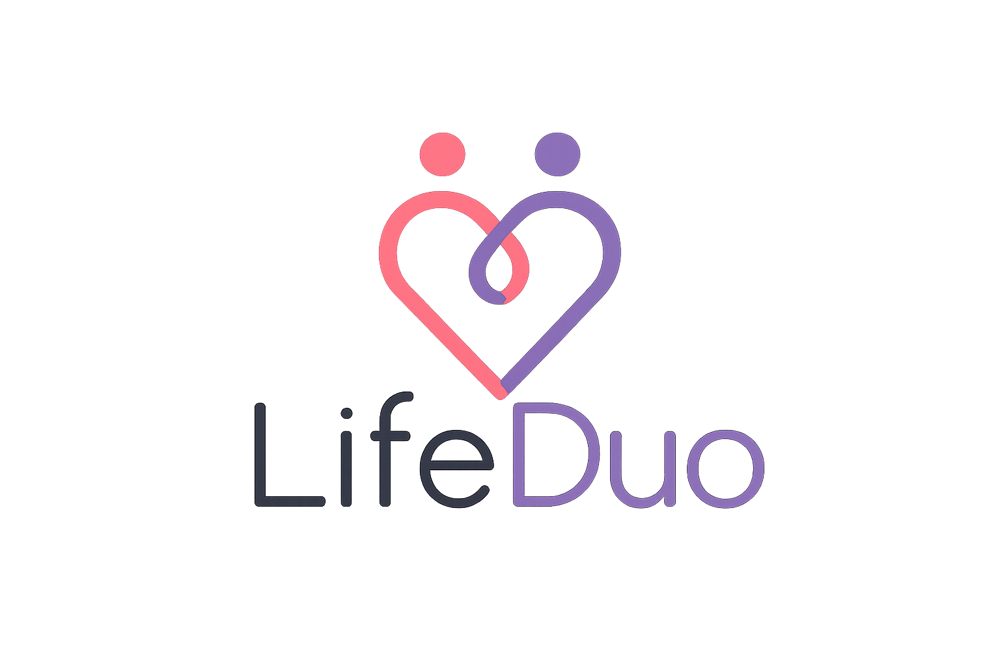
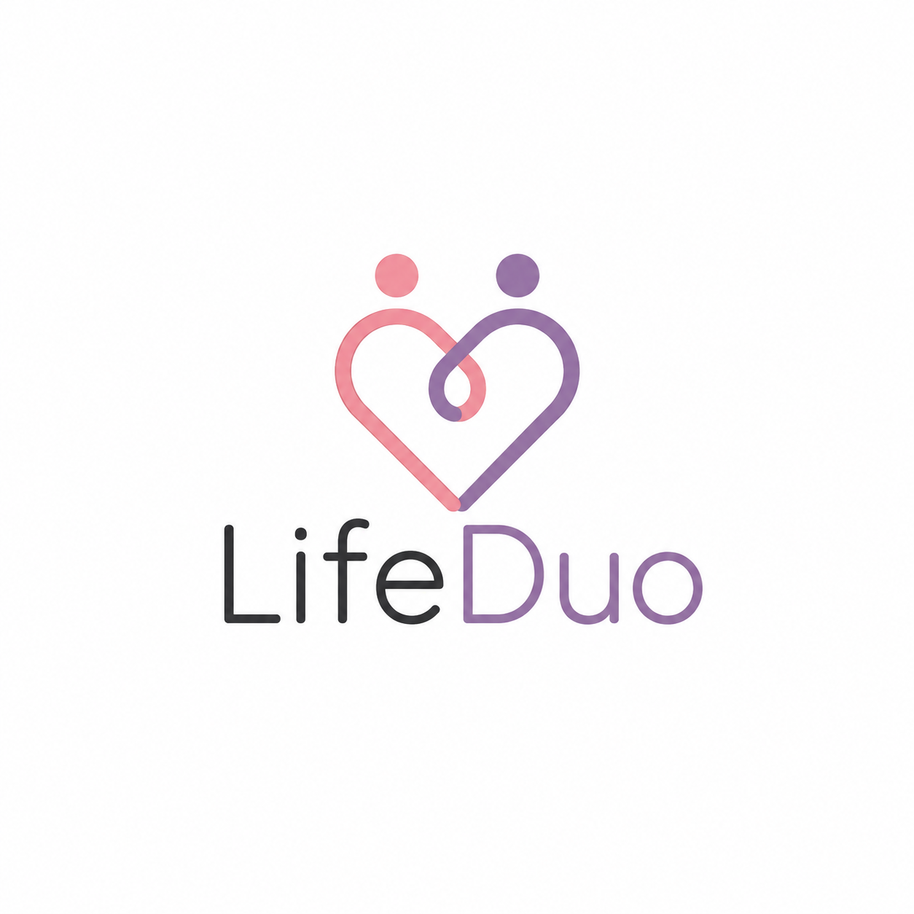
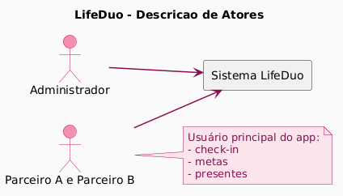
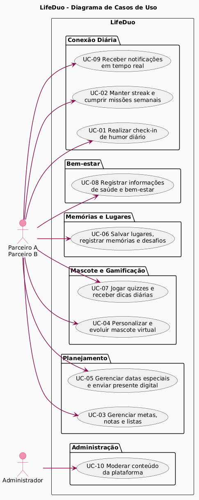
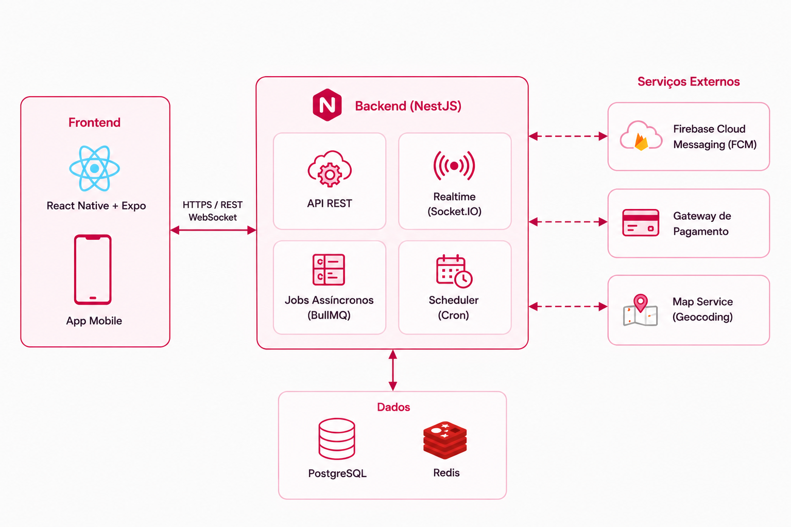

<div align="center">
  
</div>

# 💑 LifeDuo 🐾

> [!NOTE]
> **O app do casal: viva cada momento juntos.**
> LifeDuo é um app mobile para casais que combina **gamificação emocional** com **utilidade real do dia a dia** — um mascote que evolui com o relacionamento, streak diário, metas compartilhadas, presentes digitais e muito mais, tudo num só lugar, só para vocês dois.

<table>
  <tr>
    <td width="800px">
      <div align="justify">
        O <b>LifeDuo</b> nasceu da vontade de transformar pequenas ações cotidianas em momentos de conexão real entre casais. Em vez de depender de múltiplos apps — um para listas, outro para metas, outro para lembretes — o LifeDuo centraliza tudo numa experiência gamificada e emocional. O casal cria e evolui juntos um mascote virtual que reflete a saúde do relacionamento, conquista marcos, troca presentes digitais e mantém o vínculo mesmo nos dias mais corridos. O projeto une diversos padrões de engenharia de software, design centrado no usuário e psicologia positiva para entregar um produto que não apenas organiza a vida a dois, mas a torna mais significativa.
      </div>
    </td>
    <td>
      <div align="center">
        
      </div>
    </td>
  </tr>
</table>

---

## 🚧 Status do Projeto

[](https://github.com/seu-usuario/lifeduo/releases)


[](#-licença)


---

## 📚 Índice
- [Sobre o Projeto](#-sobre-o-projeto)
- [Funcionalidades Principais](#-funcionalidades-principais)
- [Tecnologias Utilizadas](#-tecnologias-utilizadas)
- [Arquitetura](#-arquitetura)
  - [Diagramas](#diagramas)
- [Instalação e Execução](#-instalação-e-execução)
- [Estrutura de Pastas](#-estrutura-de-pastas)
- [Documentações utilizadas](#-documentações-utilizadas)
- [Autor](#-autor)
- [Agradecimentos](#-agradecimentos)
- [Licença](#-licença)

---

## 📝 Sobre o Projeto

O **LifeDuo** existe porque relacionamentos saudáveis se constroem nas pequenas ações do dia a dia — e a tecnologia ainda não ajuda casais a celebrarem isso de forma integrada e divertida.

**Por que ele existe:** A maioria dos aplicativos para casais é limitada a chat ou calendário compartilhado. O LifeDuo vai além: combina gamificação emocional (XP, streaks, conquistas) com funcionalidades práticas (metas, listas, lembretes) numa única experiência coesa.

**Qual problema ele resolve:** Casais perdem o acompanhamento de marcos importantes, esquecem datas, não têm um espaço dedicado para planejar juntos e carecem de uma forma lúdica e não invasiva de manter a conexão emocional no cotidiano.

**Contexto:** Projeto acadêmico desenvolvido na disciplina de **Projeto de Software** da Engenharia de Software — PUC Minas, com potencial de evolução para produto comercial.

**Onde pode ser utilizado:** App mobile (iOS e Android) para casais em qualquer fase do relacionamento, do namoro ao casamento de longa data.

**O que o torna relevante:** A combinação de um mascote virtual que *evolui com o relacionamento real*, sistema de XP emocional, Gift Center integrado e acompanhamento de saúde e bem-estar do casal numa única plataforma.

---

## ✨ Funcionalidades Principais

### 🐾 Mascote Virtual
- **Imagem do mascote:** Cada mascote podendo ser customizado com roupinhas e acessórios.
- **Evolução por XP:** Evolução do mascote com o uso do app, que gera um emocional.
- **Reações em tempo real:** O pet fica triste quando o app não é aberto, comemora conquistas e reage ao check-in diário.

### 📅 Conexão Diária
- **Check-in de humor:** Cada parceiro registra como está; o par vê em tempo real.
- **Localização privada:** Notificação consensual quando o par chega em casa.
- **Streak de casal:** Sequência mantida apenas quando os dois fazem check-in.
- **Missões semanais:** Sorteadas automaticamente para incentivar novas experiências.
- **Mensagens agendadas:** Cartas do futuro para datas especiais.

### 🎯 Metas e Notas
- **Metas compartilhadas:** Viagem, apartamento, economias — com progresso visual e celebração ao completar.
- **Lista de desejos secreta:** O par vê o que você quer, mas não sabe se já foi comprado.
- **Notas compartilhadas, privadas e de voz.**
- **Listas de tarefas, watchlists e receitas favoritas.**

### 🗺️ Lugares para Conhecer
- **Wishlist de lugares:** Ambos adicionam destinos que querem visitar juntos.
- **Match automático:** Alerta quando os dois adicionam o mesmo lugar.
- **Mapa de memórias:** Registro geolocalizado de todos os lugares visitados juntos.
- **Descoberta curada** por localização e gostos do casal.
- **Desafios semanais de exploração** com recompensa em XP.

### 🎮 Jogos e Dicas
- **Quizzes "Quanto você me conhece?"**, verdade ou desafio e puzzles cooperativos — novo jogo toda semana.
- **Feed de dicas diárias** contextualizadas pelo tempo de relacionamento e padrão de humor do casal.
- **Conteúdo acionável:** Cada dica termina com algo pequeno para fazer hoje.

### 🎁 Datas Especiais e Presentes
- **Lembretes inteligentes:** Aniversário, primeiro beijo e datas personalizadas, com alertas customizáveis.
- **Gift Center integrado:** Gift cards digitais de Cacau Show, iFood, Spotify e outros; envio de experiências e mimos com animação de surpresa.
- **Dicas de presentes personalizadas** pela lista de desejos e gostos do par.

### 💚 Saúde e Bem-estar
- **Acompanhamento do ciclo menstrual** integrado ao app, com notificação sutil e consensual para o parceiro.
- **Perfil do pet real do casal:** Vacinas, consultas e aniversário do bichinho de estimação.

### 🏆 Gamificação
- **Sistema de XP** com níveis de evolução do mascote.
- **Conquistas colecionáveis** por marcos do relacionamento (1 mês, 1 ano, primeira viagem, etc.).
- **Streak com proteção via freeze** para imprevistos.

---

## 🛠 Tecnologias Utilizadas

### 📱 Mobile

| Tecnologia | Versão | Finalidade |
|---|---|---|
| **React Native** | 0.81 | Framework principal do app mobile |
| **Expo** | 54 | Toolchain, builds e distribuição |
| **TypeScript** | 5.x | Tipagem estática |
| **Zustand** | 4.x | Gerenciamento de estado global |
| **React Navigation** | 6.x | Navegação entre telas |
| **Expo Notifications** | — | Push notifications locais e remotas |
| **React Native Maps** | — | Mapa de memórias e descoberta de lugares |
| **Lottie** | — | Animações do mascote e Gift Center |
| **NativeWind** | 4.x | Estilização (Tailwind para RN) |

### 🖥️ Back-end

| Tecnologia | Versão | Finalidade |
|---|---|---|
| **Node.js** | 20 LTS | Runtime do servidor |
| **NestJS** | 10.x | Framework backend modular |
| **TypeScript** | 5.x | Tipagem estática |
| **PostgreSQL** | 16 | Banco de dados relacional principal |
| **Prisma** | 5.x | ORM e migrações |
| **Redis** | 7.x | Cache de sessões, streaks e filas |
| **JWT + Passport** | — | Autenticação e autorização |
| **Firebase Cloud Messaging** | — | Push notifications remotas |
| **BullMQ** | — | Filas de processamento assíncrono (missões, notificações) |
| **Swagger / OpenAPI** | — | Documentação da API |

### ⚙️ Infraestrutura & DevOps

| Tecnologia | Finalidade |
|---|---|
| **Docker + Docker Compose** | Containerização do ambiente local |
| **Expo EAS** | Build e distribuição do app nas lojas |
| **GitHub Actions** | CI/CD — testes, lint e build automatizados |
| **SonarQube** | Análise de qualidade de código |

---

## 🏗 Arquitetura

O LifeDuo adota **Clean Architecture** combinada com princípios de **DDD (Domain-Driven Design)** no back-end, e **Feature-First** no mobile.

**Decisões arquiteturais principais:**

- **Monólito modular no back-end:** Módulos independentes por domínio (`couple`, `pet`, `checkin`, `goal`, `gamification`, `gift`, `wellness`) com fronteiras bem definidas, facilitando eventual extração para microsserviços.
- **Real-time via WebSockets:** Check-in de humor, localização privada e reações do mascote são propagadas em tempo real usando Socket.IO.
- **BullMQ para missões e notificações:** Processamento assíncrono garante que streaks, missões semanais e lembretes de datas sejam disparados com confiabilidade.
- **Redis como camada de cache:** Streak ativo, estado do mascote e sessão do casal são mantidos em cache para baixa latência.
- **Privacidade por design:** Dados do ciclo menstrual e localização são opt-in explícito e criptografados em repouso.

**Infraestrutura (diagrama de implantação):**

- **Amazon CloudFront:** CDN para distribuição de assets públicos e redução de latência no app.
- **Elastic Load Balancer (ELB):** Camada de entrada com balanceamento das requisições da API.
- **Amazon EC2:** Instâncias que executam o back-end (NestJS/Socket.IO) e jobs assíncronos.
- **Amazon RDS (PostgreSQL):** Banco relacional gerenciado com backups e alta disponibilidade.

### Diagramas

Para melhor visualização e entendimento da estrutura do sistema, os diagramas principais estão organizados abaixo.

#### Diagrama de Atores


#### Diagrama de Casos de Uso


#### Diagrama de Arquitetura


> [!NOTE]
> Os diagramas acima foram gerados com **PlantUML**. Os arquivos-fonte `.puml` estão disponíveis em `/docs/puml/`.
> Para consulta de todos os diagramas do sistema, consulte em docs/LifeDuo - Documentação de Projeto.docx

---

## 🔧 Instalação e Execução

---

## 📂 Estrutura de Pastas

```
lifeduo/
├── .gitignore                     # 🧹 Arquivos não versionados
├── README.md                      # 📘 Documentação principal
├── LICENSE                        # ⚖️ Licença MIT
├── docker-compose.yml             # 🐳 Orquestração: backend + postgres + redis
├── /mobile                        # 📱 App React Native (Expo)
├── /backend                       # 🖥️ API NestJS
├── /docs                          # 📚 Documentação técnica
│   ├── /puml                      # 📊 Diagramas PlantUML (.puml)
```

---

## 🔗 Documentações utilizadas

* 📖 **Mobile Framework:** [Documentação oficial do **React Native**](https://reactnative.dev/docs/getting-started)
* 📖 **Toolchain Mobile:** [Documentação do **Expo**](https://docs.expo.dev/)
* 📖 **Build & Deploy Mobile:** [Documentação do **EAS Build**](https://docs.expo.dev/build/introduction/)
* 📖 **Back-end Framework:** [Documentação oficial do **NestJS**](https://docs.nestjs.com/)
* 📖 **ORM:** [Documentação do **Prisma**](https://www.prisma.io/docs)
* 📖 **Filas assíncronas:** [Documentação do **BullMQ**](https://docs.bullmq.io/)
* 📖 **Push Notifications:** [**Firebase Cloud Messaging (FCM)**](https://firebase.google.com/docs/cloud-messaging)
* 📖 **Containerização:** [Documentação de Referência do **Docker**](https://docs.docker.com/)
* 📖 **Diagramas:** [**PlantUML Language Reference Guide**](https://plantuml.com/guide)
* 📖 **Padrão de Commits:** [**Conventional Commits**](https://www.conventionalcommits.org/en/v1.0.0/)
* 📖 **Autenticação:** [**JWT — RFC 7519**](https://datatracker.ietf.org/doc/html/rfc7519)

---

## 👥 Autor

| 👤 Nome | 🐈 GitHub | 💼 LinkedIn | 📤 Gmail |
|---------|-----------|-------------|-----------|
| Kayke Emanoel | <div align="center"><a href="https://github.com/eman134"></a></div> | <div align="center"><a href="https://www.linkedin.com/in/kaykeeman"></a></div> | <div align="center"><a href="mailto:kaykeeman@gmail.com"></a></div> |

---

## 🙏 Agradecimentos

* [**Engenharia de Software PUC Minas**](https://www.instagram.com/engsoftwarepucminas/) — Pelo apoio institucional, estrutura acadêmica e fomento à inovação e boas práticas de engenharia.
* [**Prof. Dr. João Paulo Aramuni**](https://github.com/joaopauloaramuni) — Pelos valiosos ensinamentos sobre **Arquitetura de Software**, **Padrões de Projeto** e pelo template que norteou esta documentação.
* [**Fernanda Kipper**](https://www.instagram.com/kipper.dev/) — Pelos ensinamentos em **React Native** e melhores práticas de **Front-end mobile**.
---

## 📄 Licença

Este projeto é distribuído sob a **[Licença MIT](./LICENSE)**.

---

<div align="center">
  Feito com 💑 por Kayke Emanoel de Engenharia de Software — PUC Minas
</div>
